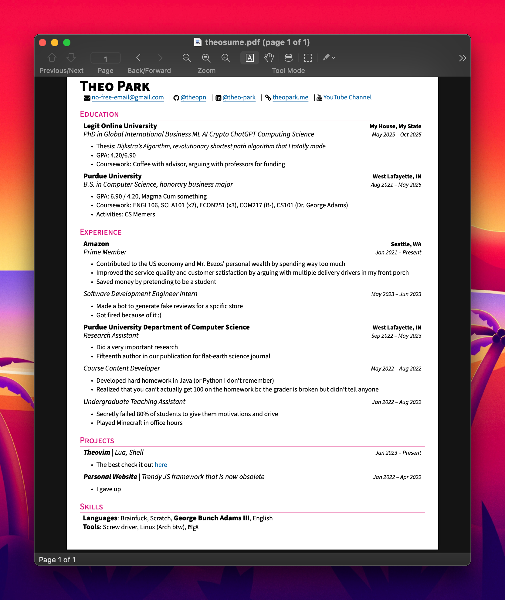

# Theo's Resume

|  |
| :-: |
| [Click here to access the PDF](./theosume.pdf) |

*The entire contents of the sample resume is a joke. I never made an Amazon review bot or have a PhD in Global International Business ML AI Crypto ChatGPT Computing Science.*


## Setup

The template was tested in:

- Fedora with TexLive (medium scheme) + Neovim with Neovim with the latest [VimTeX](https://github.com/lervag/vimtex) plug-in
- MacTeX (Homebrew No-GUI install) + Neovim and VimTex
- [Overleaf](https://www.overleaf.com/)

1. Clone this repository or upload it to Overlaf
2. Choose a font (located around line 30) by uncommenting one and commenting the others
3. Compile it using 

## Updating Information

Navigate to the "Header" section inside of `\begin{document}` and update information.
Remove header link items if you do not want them.

You can also uncomment `\begin{center}` and `\end{center}` to center the header if you want to.

```tex
%\begin{center}
  \bigname{Theo P}
  \email{someone@gmail.com}
  |
  \phone{420-0000-0000} % I personally don't have a phone in my resume
  |
  \github{my-github-username}
  |
  \linkedin{my-linkedin-username}
  |
  \website{theopark.me}
%\end{center}
```

**The instruction below is under construction.**

---

## FourItems -- For Education and Jobs

FourItems 

```tex

```

## TwoItems -- For Multiple Jobs at One Place

## TightItemize -- For Skills and Projects Section

## Credits

Inspirations:

- https://github.com/aretrosen/kyvernetes-resume/blob/master/kyvernitis-resume.cls
- https://github.com/sb2nov/resume
- https://www.overleaf.com/latex/templates/abey-resume-template/jxstkffrxxmh

